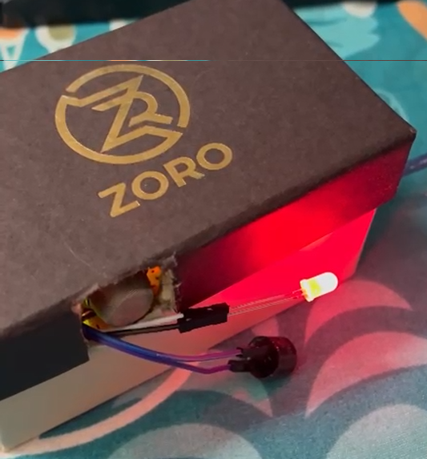

# Portable Smoke Detector 🔥

A compact, portable smoke-detection device built using an MQ-2 smoke sensor and Arduino UNO.  
The system triggers a buzzer and LED alert when smoke levels cross a safe threshold.  
This project is lightweight, battery-powered, and easy to deploy in small rooms or portable setups.

---

## Features
- Detects smoke using the MQ-2 gas sensor  
- Red LED warning indicator  
- Buzzer alarm on hazard  
- Green LED normal-condition indicator  
- Compact, box-mounted design for portability  
- Easily modifiable for IoT alerts (Blynk / WiFi module)

---

## Components Used
- Arduino UNO  
- MQ-2 Smoke Sensor  
- Red LED  
- Green LED  
- Buzzer  
- 220Ω resistors  
- Jumper wires  
- Breadboard  
- Small enclosure box (for final model)

---

## Circuit Diagram


---

## Project Images

### Breadboard Setup



---

## How It Works
1. MQ-2 reads the smoke concentration (analog signal).  
2. Arduino compares this value to a threshold.  
3. If the value > threshold:  
   - Red LED turns ON  
   - Buzzer starts beeping  
4. Otherwise:  
   - Green LED glows (safe condition)

---

## 💻 Arduino Code

```PYTHON
#define LED 2
#define Buzzer 3
#define Sensor A1

void setup() {
  Serial.begin(9600);  // Corrected from 9200 to 9600 for standard serial rate
  pinMode(LED, OUTPUT);
  pinMode(Buzzer, OUTPUT);
}

void loop() {
  int value = analogRead(Sensor);
  Serial.print("Gas Value: ");
  Serial.println(value);

  if (value > 400) {
    digitalWrite(LED, HIGH);
    digitalWrite(Buzzer, HIGH);
    Serial.println("GAS Detected!");
  } else {
    digitalWrite(LED, LOW);
    digitalWrite(Buzzer, LOW);
    Serial.println("No Gas Detected");
  }

  delay(500); // small delay for stable readings
}
```
  
